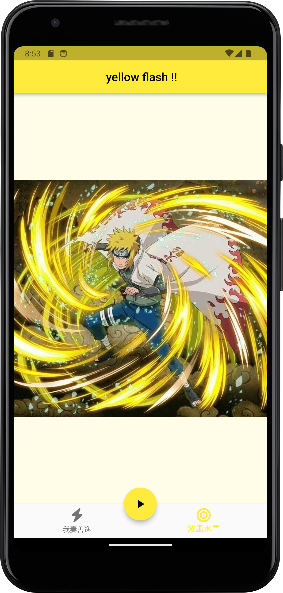

# flutter_animate_1029

This is a Flutter application that demonstrates a simple animated image gallery with a bottom navigation bar.

## Features
- Image gallery with fade-in animation.
- Start/stop animation using a floating action button.
- Bottom navigation for switching between different images.

## Usage

1. **Image Gallery**: Upon launching the app, you will be presented with an image gallery.

2. **Image Animation**: To start or stop the animation effect on the displayed image, use the floating action button located at the bottom. Click it to toggle the animation.

3. **Switching Images**: You can switch between different images using the bottom navigation bar. Simply tap on the icons in the bottom navigation to view different images.

## Widgets and UI Components

This Flutter application utilizes the following widgets and UI components:

- FadeTransition: Controls the opacity of the image with a curved animation.
- FloatingActionButton: A floating action button to control the animation.
- BottomNavigationBar: The bottom navigation bar for image selection.

## screenshot

| page_Zenitsu | page_minato |
| --- | --- |
|  |  |
