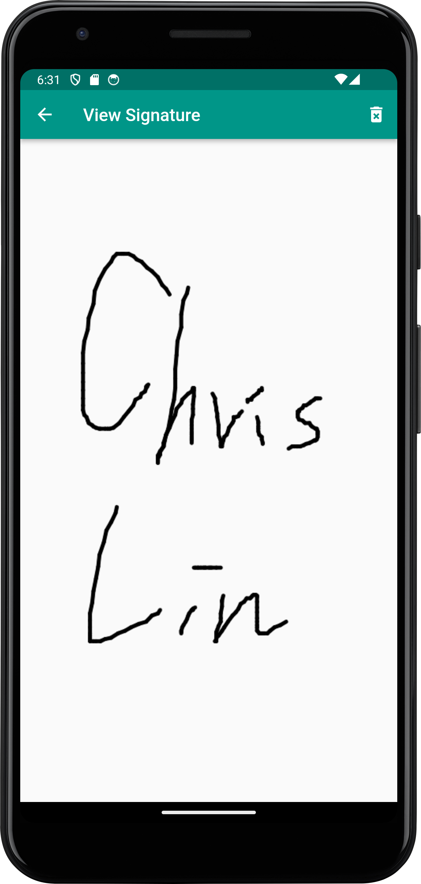

# Signature App

The Signature App is a Flutter-based application that allows users to create and manage digital signatures. With this app, users can select pen colors, draw signatures on a canvas, save their signatures, and view previously saved signatures.

## Features

- Select pen color
- Draw signatures
- Clear the canvas
- Save signature images
- View previously saved signature images

## Usage

1. Launch the app, and you'll see a blank canvas.
2. Tap the "Select Pen Color" icon at the top of the canvas to choose your preferred pen color.
3. Start drawing your signature on the canvas. You can use different pen colors in different sections.
4. If needed, tap the "Clear" icon at the top of the canvas to reset the signature area.
5. Tap the "Save" icon at the top of the canvas to save the signature image.
6. Open the side navigation drawer on the left to view a list of previously saved signature images.

## Widgets and UI Components

- `CustomPaint`: A custom painting widget used to create the signature area.
- `Drawer`: A left-side navigation drawer displaying a list of previously saved signature images.
- `AlertDialog`: A dialog for selecting the pen color.
- `GestureDetector`: Used to detect gesture events such as finger swipes.
- `ViewSignaturePage` is a widget that allows users to view previously saved signature images and provides the option to delete them.
- `imagePath`: The path to the saved image file.

## Screenshot

| default | signature |
| --- | --- |
|  |  |
