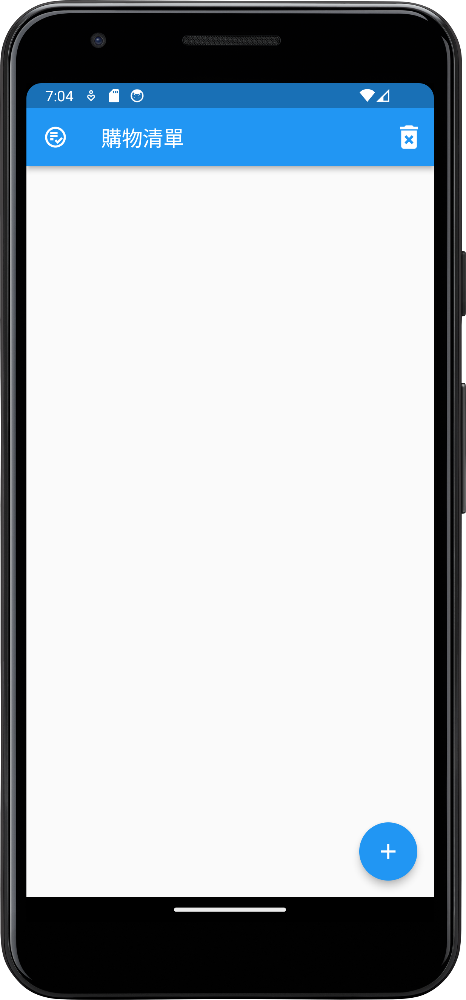
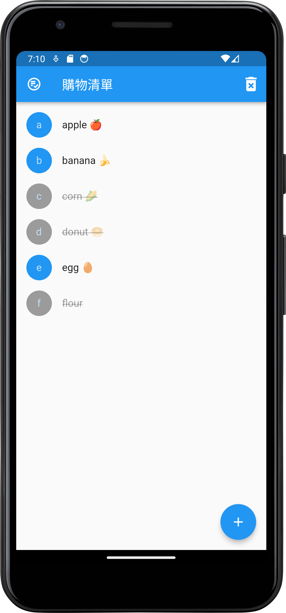

# Flutter Shopping App

Welcome to the Flutter Shopping App! This Flutter application allows you to create a shopping list, add products, and manage your shopping cart. It showcases various features of Flutter, including user interface design and state management.

## Features

- Create a shopping list and add products to it.
- Manage your shopping cart by adding or removing products.
- Delete selected products from the list.

## Usage

- Launch the app, and you'll see your shopping list.

- To add a new product to your list, tap the "+" button.

- To manage your shopping cart, tap the trash can icon to select and delete products.

- To add a product to your shopping cart, simply tap on the product in the list.

## Widgets and UI Components

This Flutter Shopping App utilizes various widgets and UI components to provide a smooth user experience. Here are some of the key components used in the application:

### 1. Shopping List

- Description: The main shopping list displayed on the app's home screen.
- Features:
  - Displays a list of products.
  - Allows you to add new products.

### 2. Delete Confirmation Dialog

- Description: A dialog that appears when you want to delete selected products.
- Features:
  - Displays a list of selected products.
  - Provides a "Cancel" and "Confirm" button to manage deletion.

### 3. Floating Action Button

- Description: The "+" button for adding new products.
- Features:
  - Opens a dialog to input the name of the new product.

These are some of the core widgets and UI components used in the Flutter Shopping App. Understanding these components will help you navigate and utilize the app effectively.

## Screenshots

| mainpage_default | mainpage_operation |
| --- | --- |
|  |  |
