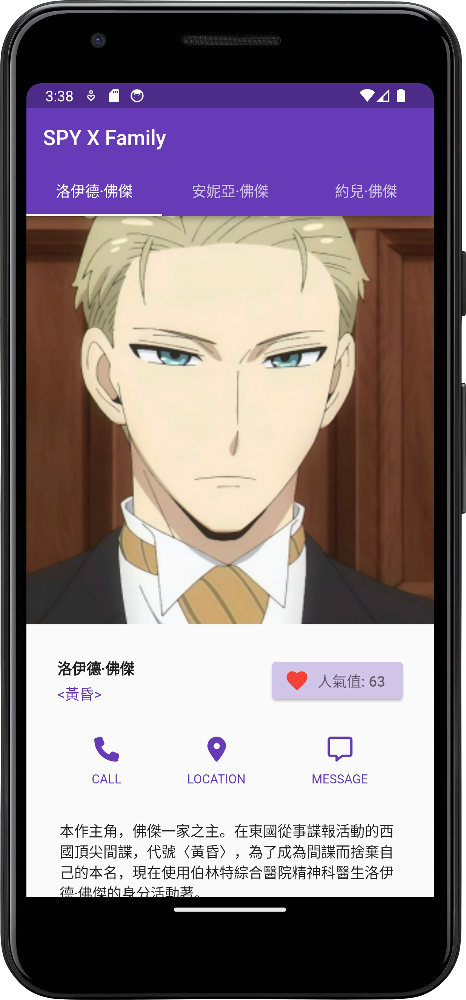
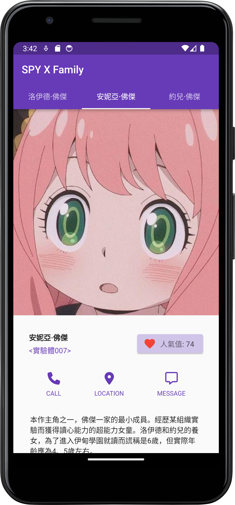
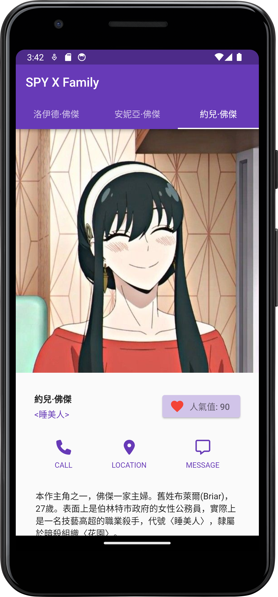

# Flutter interface design application

This is a Flutter application that showcases information about characters from the manga/anime series "SPY X FAMILY." The app allows you to explore the details of different characters, including their names, codenames, and other information. You can also interact with the characters by increasing their popularity.

## Features

This Flutter app, titled "SPY X Family," showcases information about the main characters of the SPY X Family series. Here are its key features:

- Display detailed information about the main characters.
- Show character images, names, and introductory descriptions.
- Allow users to increment the popularity of each character.
- Access additional options via call, location, and message buttons.
- Utilize an elegant and user-friendly tabbed interface for character selection.

## Usage

The app provides information about characters from "SPY X FAMILY." You can browse through different characters and learn about their names, codenames, and other details. Additionally, you can interact with the characters by increasing their popularity.

## Widgets and UI Components

The app is built using various Flutter widgets and UI components to create its user interface. Here are some of the key components used in the app:

- MaterialApp: The root widget of the app that sets the overall theme and configuration.

- TabBar: A widget that displays a tab bar for switching between different character details.

- ListView: Used to create a scrollable list of character information.

- Image: Displays character images fetched from local assets.

- ElevatedButton: Provides a button for incrementing the popularity of a character.

- Text: Displays character names, codenames, and other text information.

- Container: Used for padding and layout control.

- Column: Organizes components vertically.

- FittedBox: Scales and aligns character images.

- FontAwesomeIcons: Icons from the Font Awesome icon library.

These are some of the main widgets and UI components used in the app to present character information and interact with them.

## Screenshots

| page1 | page2 | page3 |
| --- | --- | --- |
|  |  |  |

